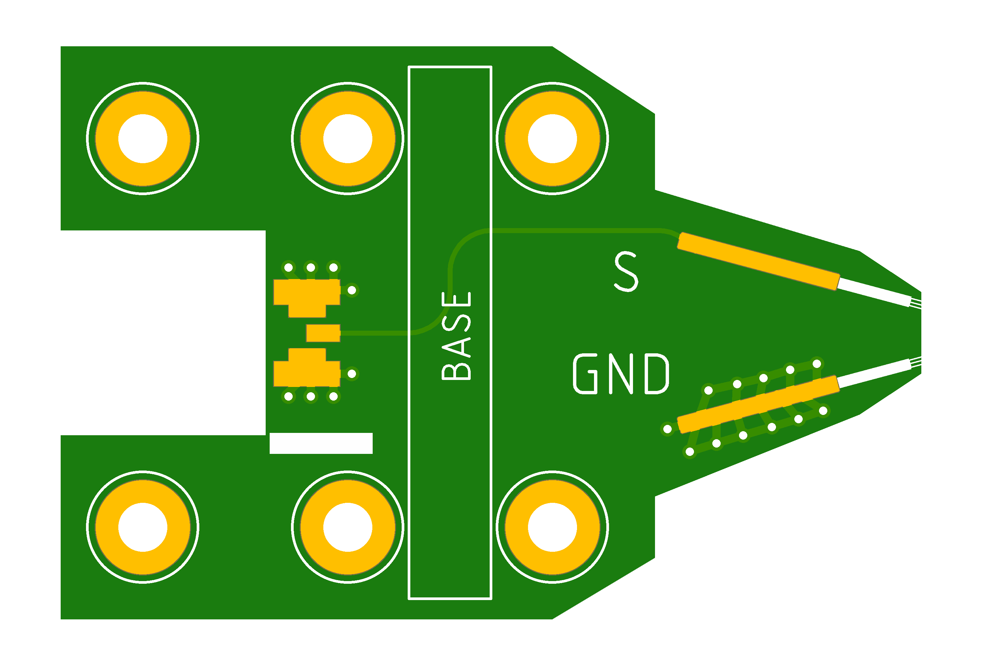
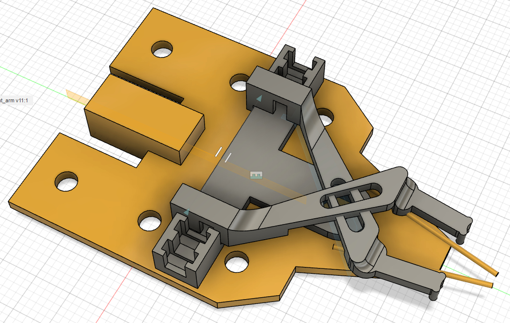

# PDNPulse Probe

PDNPulse Probe is our custom probe for the PDNPulse project. 
In this folder you will find the source files (Eagle PCB design files and STL files for 3D printing) for the probe.
This document will guide you through the process of building the probe.

## Features of the probe
+ Low cost
+ Accurate
+ Flexible adjustment of the distance between the probe tips
    >This is the main motivation why we want to build our own probe. The probe tips are adjustable using a screw driver. This is useful when we want to attached the probe to a PCB. We can adjust the distance between the probe tips to match the distance between the pads on the PCB without replacing the probes. This is not possible on the commercial probes.

## How to USE the probe
+ Connect the probe to Vector Network Analyzer (VNA) using the SMA connector
+ Connect the probe to a positioner or holder using the screw and nut
+ Adjust the distance between the probe tips using the screw driver (M2)

## How to BUILD the probe

There are two parts to the probe: the PCB and the mechanical tuner. The PCB is the main part of the probe and contains the circuitry for the probe. The mechanical tuner is used to adjust the distance between the probe tips.

### 0. What you need
+ Test probes with springs (x2). We bought ours from Taobao. Ours are 0.5mm in diameter and 16mm in length (13mm for the tip and 3mm for the spring). There are similar ones on [Amazon](https://www.amazon.com/uxcell-Spherical-Radius-Spring-Probes/dp/B007Q8JILQ/ref=asc_df_B007Q8JILQ/?tag=hyprod-20&linkCode=df0&hvadid=416668650463&hvpos=&hvnetw=g&hvrand=1946963476250155027&hvpone=&hvptwo=&hvqmt=&hvdev=c&hvdvcmdl=&hvlocint=&hvlocphy=9022867&hvtargid=pla-833155082360&psc=1&tag=&ref=&adgrpid=90730998421&hvpone=&hvptwo=&hvadid=416668650463&hvpos=&hvnetw=g&hvrand=1946963476250155027&hvqmt=&hvdev=c&hvdvcmdl=&hvlocint=&hvlocphy=9022867&hvtargid=pla-833155082360).

+ Edge mount SMA connector (x1).

+ M2 screws, nuts and washers:
    + M2x6 screws (x1)
    + M2x12 screws (x2)
    + M2 nuts (x3)
    + M2 washers (x7)

### 1. Fabricate the PCB and 3D print the mechanical tuner

+ The PCB is designed in `Eagle CAD`. You can find the source files in the `pcb` folder. We used [JLCPCB](https://jlcpcb.com/) for our fabrication.
The PCB layout is shown below:

+ 3D print the mechanical tuner using the STL files in the `mechanical_tuner` folder. There are three parts: the base, the left and right arms. *Print the parts with the finest resolution possible.* The mechanical tuner is shown below (gray parts):

### 2. Assemble the PCB

+ Solder the SMA connector to the PCB
+ Solder the two probe tips to the PCB (the bottom side of the PCB labeled as `GND` and `S`). You should solder the tips such that they align with the marks on the PCB.

### 3. Assemble the mechanical tuner

The mechanism of the tuner is that it builds a "seazor" like structure. The base is fixed to the PCB and the left and right arms are connected to the base using the screws and nuts. The distance between the probe tips is adjusted by moving the left and right arms.

To assemble the tuner, follow the steps below:

+ Stick the base to the PCB using the hot glue gun. Make sure the base is aligned with the marks on the PCB.

+ Put one `M2 Nut` on Position `1`, two `M2 Washers` on Position `3` and two `M2 Washers` on Position `5`. 

+ Put one `M2x12 Screw` on Position `2` and one `M2x12 Screw` on Position `4`. 

+ Put one `M2 Nut` on Position `6` of the left arm and one `M2 Nut` on Position `6` of the right arm.

+ Put left arm and right arm on the base. Make sure the two screws are inserted into the nuts on the arms.

+ Adjust the distance between the left and right arms and tighten the arms using the `M2x6 Screw` + `M2 Washers` and `M2 Nut` on Position `1`.

+ Finally, put the two probe tips into the two holes on the left and right arms.

> Note: You may want to use hot glue to fix some parts of the tuner to make it more stable.